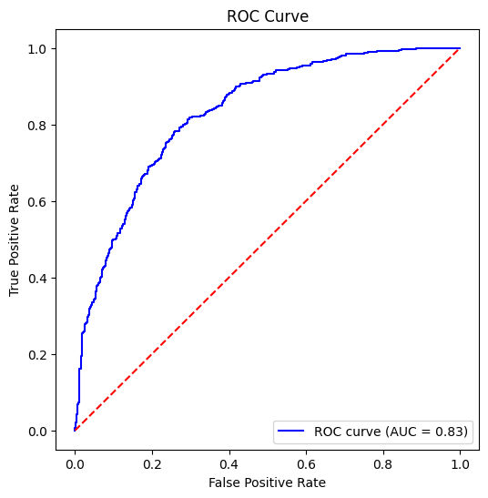
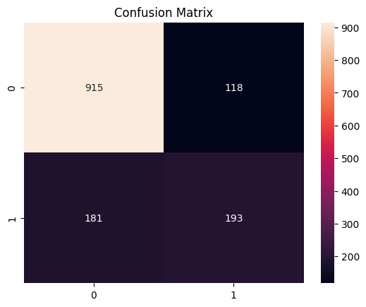
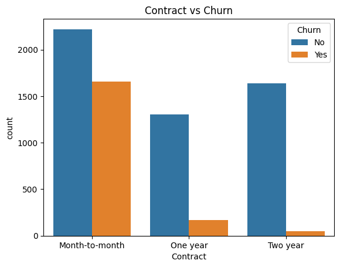

# Customer Churn Prediction – Data Analyst Project

## Problem Statement
การยกเลิกใช้บริการของลูกค้า (Customer Churn) เป็นปัญหาสำคัญของธุรกิจที่ใช้รูปแบบการสมัครสมาชิก เนื่องจากต้นทุนในการหาลูกค้าใหม่สูงกว่าการรักษาลูกค้าเดิมไว้
อย่างไรก็ตาม หลายธุรกิจยังขาดความเข้าใจที่ชัดเจนว่า ลูกค้ากลุ่มใดมีแนวโน้มจะยกเลิกใช้บริการ และปัจจัยใดเป็นสาเหตุของการเกิด Churn

โครงการนี้มีวัตถุประสงค์เพื่อใช้ข้อมูลลูกค้าในการ :
- คาดการณ์ลูกค้าที่มีแนวโน้มจะยกเลิกใช้บริการ (Customer Churn)
- วิเคราะห์ปัจจัยสำคัญที่ส่งผลต่อการเกิด Churn
- นำเสนอข้อเสนอแนะเชิงธุรกิจที่สามารถนำไปใช้ได้จริงเพื่อช่วยลดอัตราการสูญเสียลูกค้า

---

## Objective
- วิเคราะห์พฤติกรรมของลูกค้าที่เกี่ยวข้องกับการยกเลิกใช้บริการ (Churn) 
- สร้างโมเดลเพื่อคาดการณ์ลูกค้าที่มีความเสี่ยงสูงต่อการยกเลิกใช้บริการ  
- แปลงผลการวิเคราะห์ข้อมูลให้เป็น Insight เชิงธุรกิจที่สามารถนำไปใช้ได้จริง
---

## Dataset
- ชุดข้อมูล Telco Customer Churn Dataset  
- ประกอบด้วยข้อมูลลูกค้าประมาณ 50,000 ราย
- ตัวแปรที่ใช้ในการวิเคราะห์ ได้แก่
  - ประเภทสัญญา (Contract type)
  - ระยะเวลาการใช้งาน (Tenure)
  - ค่าใช้จ่ายรายเดือน (Monthly charges)
  - วิธีการชำระเงิน (Payment method)
  - บริการเสริมที่ใช้งาน (Additional services)
  -สถานะการยกเลิกใช้บริการ (Churn: Yes / No)

---

## Tools & Skills
- Python (pandas, numpy)
- Data Visualization (matplotlib)
- Machine Learning (scikit-learn)
- Logistic Regression
- Exploratory Data Analysis (EDA)
- Business Insight & Data Storytelling

---

## Analysis Workflow
1. โหลดข้อมูลและตรวจสอบภาพรวมของชุดข้อมูล 
2. วิเคราะห์ข้อมูลเชิงสำรวจ (Exploratory Data Analysis: EDA)  
3. ทำความสะอาดข้อมูลและเตรียมข้อมูลก่อนการสร้างโมเดล
4. แปลงข้อมูลตัวแปร (Feature Encoding) 
5. แบ่งข้อมูลสำหรับการฝึกโมเดลและทดสอบผลลัพธ์ (Train-Test Split)
6. สร้างและฝึกโมเดล Logistic Regression
7. ประเมินประสิทธิภาพของโมเดล
8. สรุป Insight เชิงธุรกิจและข้อเสนอแนะที่สามารถนำไปใช้ได้จริง

---

## Model Performance

### ROC Curve

กราฟ ROC แสดงให้เห็นว่าโมเดลสามารถแยกแยะระหว่างลูกค้าที่มีแนวโน้มจะยกเลิกใช้บริการ (Churn) และลูกค้าที่ไม่ยกเลิกใช้บริการได้อย่างมีประสิทธิภาพ
### Confusion Matrix

เมทริกซ์ความสับสน (Confusion Matrix) สรุปผลการทำนายของโมเดล และแสดงให้เห็นว่าโมเดลมีประสิทธิภาพในการระบุลูกค้าที่ไม่ยกเลิกใช้บริการได้ดี ขณะเดียวกันยังสามารถตรวจจับกรณีลูกค้าที่มีการยกเลิกใช้บริการได้ในระดับที่น่าพอใจ
  
---

## Key Business Insight
### Contract Type vs Churn

ลูกค้าที่ใช้สัญญาแบบ รายเดือน (Month-to-Month) มีอัตราการยกเลิกใช้บริการสูงกว่าลูกค้าที่ทำสัญญาระยะยาวอย่างมีนัยสำคัญ

---

## Key Churn Drivers
- สัญญาแบบรายเดือน (Month-to-Month Contract)  
- ระยะเวลาการใช้งานของลูกค้าที่สั้น (Short Customer Tenure) 
- ค่าใช้จ่ายรายเดือนสูง (High Monthly Charges)
- ไม่มีการใช้งานบริการเสริม เช่น Online Security
- การชำระเงินด้วย Electronic Check  

---

## Business Recommendations
- เสนอโปรโมชันหรือสิทธิประโยชน์เพื่อรักษาลูกค้าที่ใช้สัญญาแบบรายเดือน (Month-to-Month)  
- กระตุ้นให้ลูกค้าเปลี่ยนเป็นสัญญาระยะยาวด้วยส่วนลดหรือสิทธิประโยชน์เพิ่มเติม
- นำเสนอบริการแบบแพ็กเกจ (Bundled Services) สำหรับลูกค้าที่มีความเสี่ยงสูงต่อการยกเลิกใช้บริการ
- ออกแบบแคมเปญรักษาลูกค้าแบบเจาะกลุ่ม โดยเฉพาะลูกค้าใหม่ที่มีระยะเวลาการใช้งานสั้น
---

## Conclusion
โปรเจกต์นี้แสดงให้เห็นถึงการนำการวิเคราะห์ข้อมูลและการสร้างโมเดลเชิงคาดการณ์มาใช้เพื่อทำความเข้าใจพฤติกรรมของลูกค้า และสนับสนุนการตัดสินใจทางธุรกิจ
Insight ที่ได้จากการวิเคราะห์สามารถช่วยให้ธุรกิจวางแผนเชิงรุกในการลดการยกเลิกใช้บริการของลูกค้า และปรับปรุงกลยุทธ์การรักษาลูกค้าให้มีประสิทธิภาพมากยิ่งขึ้น

---

## Author
**Dolthida**  
Computer Science Student | Aspiring Data Analyst
